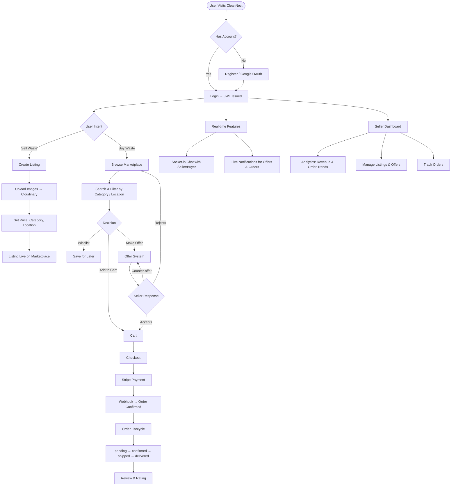

<div align="center">

# ♻️ CleanNect

### *A Full-Stack Waste Management Marketplace*

**Connecting waste sellers and buyers for a cleaner, greener tomorrow.**

[](https://react.dev)
[](https://nodejs.org)
[](https://mongodb.com)
[](https://socket.io)
[](https://stripe.com)
[](https://cloudinary.com)

[](https://cleannect.vercel.app)

</div>

---

## 📌 Overview

**CleanNect** is a production-grade, full-stack web application that functions as a **peer-to-peer marketplace for recyclable and reusable waste materials**. Users can list waste materials (plastic, metal, paper, e-waste, etc.), negotiate via offers, purchase through integrated Stripe payments, and communicate in real time — all powered by a modern MERN stack.

> Built to demonstrate end-to-end full-stack engineering: REST APIs, real-time WebSockets, OAuth 2.0, cloud media, payment processing, and a polished React SPA.

---

## ✨ Key Features

| Feature | Description |
|---|---|
| 🛒 **Marketplace** | Browse, search, and filter waste listings by category, price, and location |
| 📦 **Listing Management** | Create, edit, and archive listings with multi-image upload via Cloudinary |
| 💬 **Real-time Chat** | Socket.io-powered messaging with live typing indicators between buyers & sellers |
| 💸 **Stripe Payments** | Secure end-to-end payment flow with webhook-verified order fulfillment |
| 🤝 **Offer System** | Buyers can make counter-offers; sellers can accept, reject, or negotiate |
| 🗺️ **Map Integration** | OpenStreetMap + Leaflet for geolocation-based listing discovery |
| 🔔 **Notifications** | Real-time push notifications for orders, offers, and messages |
| ❤️ **Wishlist & Cart** | Save and purchase multiple listings in a single checkout |
| 📊 **Analytics Dashboard** | Seller insights — revenue, order trends, top listings |
| 🔐 **Auth** | JWT-based auth + Google OAuth 2.0 (Passport.js) |
| 🌍 **i18n Ready** | Multi-language support architecture |

---

## 🔄 Project Workflow

### End-to-End User Journey



### Workflow Breakdown

#### 🧑 Buyer Flow
1. **Browse** — Search listings by category (plastic, metal, e-waste, etc.), price range, or location using the interactive map
2. **Discover** — View listing details, seller rating, images, and exact pickup location on a Leaflet map
3. **Engage** — Add to wishlist, cart, or make a custom price offer to the seller
4. **Negotiate** — The offer system allows back-and-forth counter-offers via real-time notifications
5. **Purchase** — Checkout with Stripe; payment intent created server-side, confirmed client-side
6. **Track** — Monitor order lifecycle from `pending` → `confirmed` → `shipped` → `delivered`
7. **Review** — Leave a star rating and review upon order completion

#### 🏭 Seller Flow
1. **List** — Create a listing with title, description, category, quantity, unit, price, and up to multiple images
2. **Geo-tag** — Attach a pickup address; coordinates are stored for map display
3. **Receive Offers** — Get notified instantly when a buyer makes an offer; accept, reject, or counter
4. **Manage Orders** — View incoming orders and update shipment status
5. **Analyse** — Use the analytics dashboard for revenue charts, bestselling items, and order volume trends

#### ⚡ Real-time Layer
```
Client (React)  ←──Socket.io──→  Server (Express)
     │                                  │
     │  joinConversation(userId)         │  io.to(room).emit('newMessage')
     │  typing / stopTyping             │  io.to(userId).emit('notification')
     └──────────────────────────────────┘
```
All real-time events are authenticated via JWT tokens on the Socket.io handshake.

---

## 🏗️ Architecture

```
cleannect-waste-management/
├── frontend/               # React 19 + Vite SPA
│   ├── src/
│   │   ├── pages/          # Route-level page components (public + dashboard)
│   │   ├── components/     # Reusable UI components
│   │   ├── contexts/       # React Context (auth, cart, notifications)
│   │   ├── layouts/        # PublicLayout & DashboardLayout
│   │   └── lib/            # Axios instance, socket client
│   └── vercel.json         # Frontend SPA rewrite config
│
├── backend/                # Express.js REST API + Socket.io
│   ├── controllers/        # Business logic for all domains
│   ├── routes/             # API route definitions (12 resource routes)
│   ├── models/             # Mongoose schemas (User, Listing, Order, ...)
│   ├── middleware/         # Auth guard, error handler, validation
│   └── config/             # DB connection, Passport, Cloudinary
│
├── api/                    # Vercel serverless function entry point
├── docker-compose.yml      # Local Docker setup
└── package.json            # Root monorepo dependencies
```

---

## 🛠️ Tech Stack

### Frontend
| Technology | Purpose |
|---|---|
| **React 19** | UI framework with concurrent mode |
| **Vite 7** | Lightning-fast build tool & dev server |
| **TailwindCSS 4** | Utility-first styling |
| **React Router 7** | Client-side routing & nested layouts |
| **Socket.io Client** | Real-time bidirectional communication |
| **Leaflet + React-Leaflet** | Interactive maps with OpenStreetMap tiles |
| **Axios** | HTTP client with interceptors |

### Backend
| Technology | Purpose |
|---|---|
| **Node.js + Express 5** | REST API server |
| **MongoDB + Mongoose 8** | Document database with advanced indexing |
| **Socket.io** | WebSocket server for real-time events |
| **Passport.js** | Google OAuth 2.0 authentication strategy |
| **JSON Web Tokens** | Stateless session management |
| **Stripe SDK** | Payment processing & webhook signature verification |
| **Cloudinary** | Cloud image storage & transformation |
| **Helmet + Rate Limiting** | API security hardening |
| **bcryptjs** | Password hashing |

### Infrastructure
| Technology | Purpose |
|---|---|
| **Vercel** | Frontend static hosting + serverless API |
| **Docker + Compose** | Containerized local development |
| **MongoDB Atlas** | Managed cloud database |

---

## 🚀 Getting Started

### Prerequisites

- Node.js ≥ 18
- MongoDB (local or [Atlas](https://cloud.mongodb.com))
- A [Stripe](https://stripe.com) account (test keys)
- A [Cloudinary](https://cloudinary.com) account
- Google OAuth credentials from [Google Cloud Console](https://console.cloud.google.com)

### Option 1 — Docker (Recommended)

```bash
git clone https://github.com/your-username/cleannect-waste-management.git
cd cleannect-waste-management

# Copy and fill in the env file
cp backend/.env.example backend/.env

docker-compose up --build
```

App will be available at `http://localhost:3000`.

### Option 2 — Local Development

```bash
# Clone the repo
git clone https://github.com/your-username/cleannect-waste-management.git
cd cleannect-waste-management

# --- Backend ---
cd backend
npm install
cp .env.example .env      # fill in your secrets
npm run dev               # starts on http://localhost:5000

# --- Frontend (new terminal) ---
cd frontend
npm install
npm run dev               # starts on http://localhost:5173
```

---

## ⚙️ Environment Variables

### `backend/.env`
```env
PORT=5000
NODE_ENV=development
MONGODB_URI=mongodb://localhost:27017/cleannect-waste-management
JWT_SECRET=your_strong_jwt_secret
JWT_EXPIRE=1d

CLOUDINARY_CLOUD_NAME=your_cloud_name
CLOUDINARY_API_KEY=your_api_key
CLOUDINARY_API_SECRET=your_api_secret

STRIPE_SECRET_KEY=sk_test_...
STRIPE_WEBHOOK_SECRET=whsec_...

FRONTEND_URL=http://localhost:5173
GOOGLE_CLIENT_ID=your_google_client_id
GOOGLE_CLIENT_SECRET=your_google_client_secret
GOOGLE_CALLBACK_URL=http://localhost:5000/api/auth/google/callback
```

### `frontend/.env`
```env
VITE_API_BASE_URL=http://localhost:5000/api
```

---

## 📡 API Reference

All endpoints are prefixed with `/api/`.

| Resource | Endpoint | Description |
|---|---|---|
| **Auth** | `POST /api/auth/register` | Register with email/password |
| | `POST /api/auth/login` | Login, returns JWT |
| | `GET /api/auth/google` | Initiate Google OAuth 2.0 |
| **Listings** | `GET /api/listings` | Browse marketplace (filter, search, paginate) |
| | `POST /api/listings` | Create a new listing with image upload |
| | `PUT /api/listings/:id` | Update listing details |
| **Orders** | `POST /api/orders` | Place an order |
| | `GET /api/orders` | Get user's orders (buyer & seller) |
| **Payments** | `POST /api/payments/create-intent` | Create Stripe PaymentIntent |
| | `POST /api/payments/verify` | Stripe webhook — verify & fulfill order |
| **Offers** | `POST /api/offers` | Make a price offer on a listing |
| | `PATCH /api/offers/:id` | Accept / reject / counter an offer |
| **Messages** | `GET /api/messages/:userId` | Fetch conversation thread |
| | `POST /api/messages` | Send a message (also emits via Socket.io) |
| **Reviews** | `POST /api/reviews` | Leave a review for a completed order |
| **Analytics** | `GET /api/analytics` | Seller dashboard stats |
| **Wishlist** | `POST /api/wishlist` | Add/remove listing from wishlist |

---

## 🗄️ Data Models

```
User ──< Listing ──< Order ─── Payment
  │          │
  │          └──< Offer
  │          └──< Review
  │
  └──< Message (to/from another User)
  └──< Notification
  └──< Cart
  └──< Wishlist
```

Key model highlights:
- **Listing** — geo-coordinates (lat/lng) for map display, text-search index on title+description, `initialQuantity` for "selling fast" badge logic
- **User** — local + Google OAuth with `authProvider` field, seller rating aggregation
- **Order** — full lifecycle: `pending → confirmed → shipped → delivered → completed`
- **Payment** — Stripe PaymentIntent ID and webhook verification status

---

## 🔐 Security

- **Helmet.js** — sets secure HTTP headers on all responses
- **Rate limiting** — 100 req/15min per IP on all `/api/` routes
- **JWT** — HS256 signed tokens, verified on every protected route
- **Webhook signature** — Stripe payload verified via `express.raw()` + `stripe.webhooks.constructEvent()`
- **Password hashing** — bcrypt with salt rounds = 10
- **CORS** — configurable origin allowlist

---

## 🌐 Deployment

The project is deployed on **Vercel** using a monorepo configuration:

- **Frontend** — Vite SPA, served as static files with SPA rewrite fallback
- **Backend API** — Express.js wrapped as Vercel serverless functions (`api/index.js`)
- **Database** — MongoDB Atlas (cloud-hosted)
- **Media** — Cloudinary CDN

---

## 🤝 Contributing

Pull requests are welcome! For major changes, please open an issue first to discuss what you'd like to change.

1. Fork the repo
2. Create your feature branch (`git checkout -b feature/AmazingFeature`)
3. Commit your changes (`git commit -m 'Add some AmazingFeature'`)
4. Push to the branch (`git push origin feature/AmazingFeature`)
5. Open a Pull Request

---

## 📄 License

This project is licensed under the **ISC License**.

---

<div align="center">

Made with 💚 for a cleaner planet

**[🌐 Live Demo](https://cleannect.vercel.app)** • **[Report Bug](https://github.com/ISudhan/cleannect-waste-management/issues)** • **[Request Feature](https://github.com/ISudhan/cleannect-waste-management/issues)**

</div>
